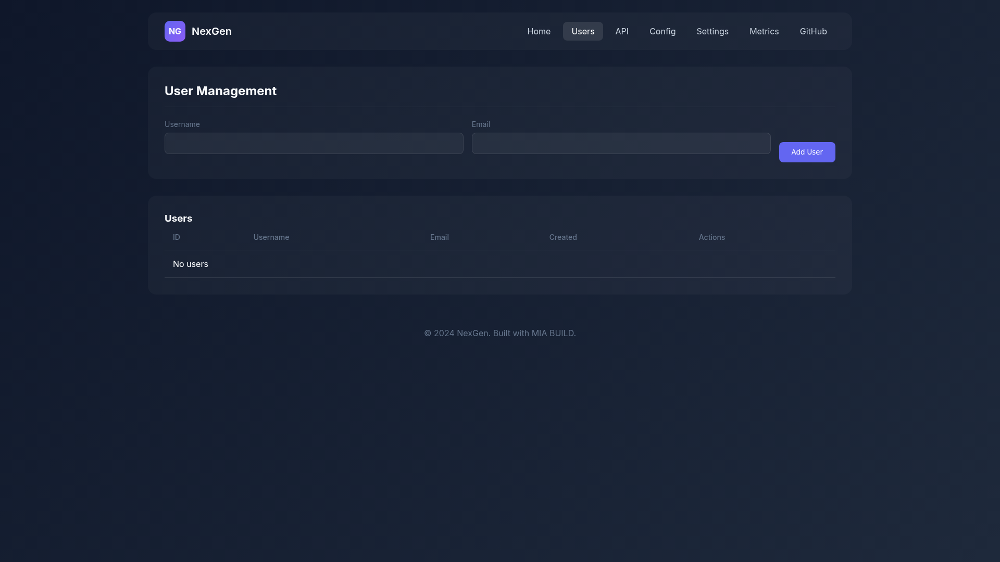
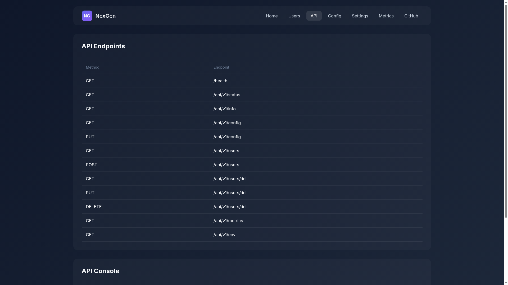
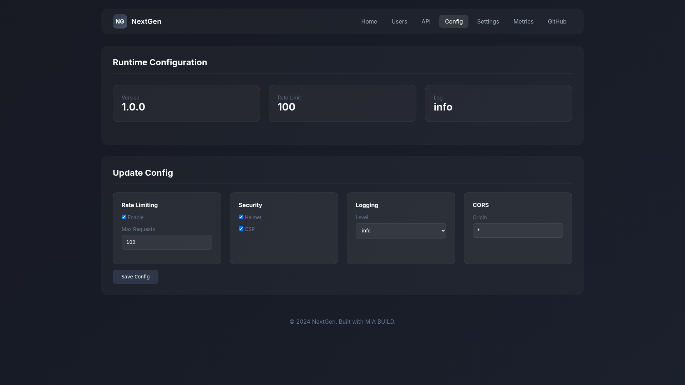
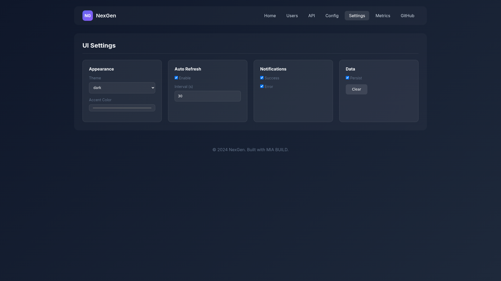
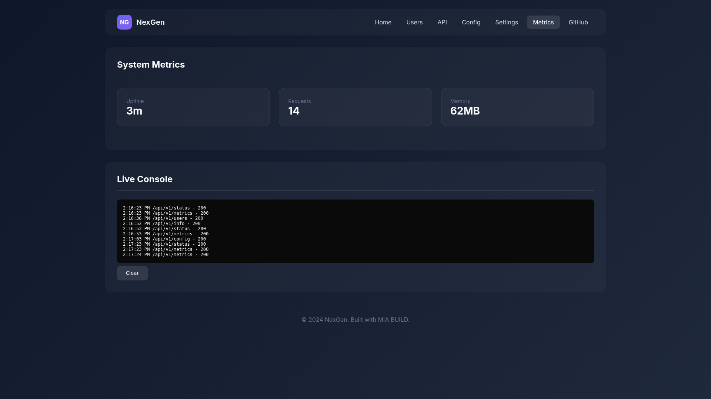

# NextGen Backend Platform

**Version:** 2.0.1  
**Type:** Enterprise Backend API System  
**Author:** MIA BUILD  
**License:** MIT

---

## 🚀 Overview

NextGen Backend is a professional, production-ready backend API system designed for enterprise applications requiring high availability, security, and scalability. Built with modern best practices for REST APIs, microservices, and distributed systems.

### Key Features

- **RESTful API** with Express.js
- **GraphQL Support** with Apollo Server
- **gRPC Services** for inter-service communication
- **Real-time** WebSocket support
- **Rate Limiting** & throttling
- **CORS** & security headers
- **JWT Authentication** & authorization
- **Configuration API** for runtime settings
- **System Metrics** monitoring
- **Professional UI** for dashboard & testing

---

## 📋 Use Cases

NextGen Backend is ideal for:

### 1. **Web Application Backends**
- E-commerce platforms
- Content management systems (CMS)
- Social media platforms
- SaaS applications

### 2. **Mobile App Backends**
- REST API for iOS/Android apps
- Real-time features with WebSocket
- Push notification services

### 3. **Microservices Architecture**
- Service-to-service communication
- API Gateway implementation
- Event-driven systems

### 4. **Enterprise Systems**
- ERP & CRM systems
- Financial services
- Healthcare platforms
- Government applications

### 5. **IoT Platforms**
- Device management
- Sensor data ingestion
- Real-time analytics

### 6. **E-commerce & Retail**
- Product catalog APIs
- Order management
- Payment processing integration

---

## 🏗️ Architecture

```
NextGen Backend/
├── src/
│   ├── api/              # REST & GraphQL controllers
│   ├── core/             # Core business logic
│   ├── config/            # Configuration management
│   ├── security/         # Auth & encryption
│   ├── resilience/       # Circuit breakers, retries
│   ├── messaging/         # Event bus & queues
│   ├── monitoring/        # Health & metrics
│   ├── storage/           # Database & file storage
│   └── workflow/          # Business workflows
├── packages/
│   ├── api/              # Express API server
│   ├── ui/                # Web dashboard
│   └── core/              # Shared utilities
└── dist/                  # Compiled JavaScript
```

---

## 🚦 Quick Start

### Prerequisites
- Node.js 18+
- npm or yarn

### Installation

```bash
# Clone the repository
git clone https://github.com/DanijelTech/Backend---developed-with-MiaBuild.git
cd Backend---developed-with-MiaBuild

# Install dependencies
npm install

# Build the project
npm run build

# Start the server
npm start
```

### Development Mode

```bash
# Run with hot reload
npm run dev

# Run tests
npm test
```

### Docker

```bash
# Build Docker image
docker build -t nextgen-backend .

# Run container
docker run -p 3000:3000 nextgen-backend
```

---

## 📖 API Documentation

### Base URL
```
http://localhost:3000
```

### Core Endpoints

| Method | Endpoint | Description |
|--------|----------|-------------|
| GET | `/health` | Health check |
| GET | `/api/v1/status` | API status |
| GET | `/api/v1/info` | System info |
| GET | `/api/v1/config` | Get configuration |
| PUT | `/api/v1/config` | Update configuration |
| GET | `/api/v1/metrics` | System metrics |
| GET | `/api/v1/env` | Environment variables |
| GET | `/api/v1/users` | List users |
| POST | `/api/v1/users` | Create user |
| GET | `/api/v1/users/:id` | Get user |
| PUT | `/api/v1/users/:id` | Update user |
| DELETE | `/api/v1/users/:id` | Delete user |

### Example Requests

#### Health Check
```bash
curl http://localhost:3000/health
```

#### Get Metrics
```bash
curl http://localhost:3000/api/v1/metrics
```

#### Create User
```bash
curl -X POST http://localhost:3000/api/v1/users \
  -H "Content-Type: application/json" \
  -d '{"username": "john", "email": "john@example.com"}'
```

---

## 🎨 Web Dashboard

Access the professional web UI at:
```
http://localhost:3000
```

### Dashboard Tabs

| Tab | Description |
|-----|-------------|
| **Home** | System status dashboard |
| **Users** | User management |
| **API** | API endpoint testing |
| **Config** | Runtime configuration |
| **Settings** | UI preferences |
| **Metrics** | Live metrics console |

---

## ⚙️ Configuration

### Environment Variables

```bash
# Server
PORT=3000
NODE_ENV=production

# Security
JWT_SECRET=your-secret-key
JWT_EXPIRY=24h

# Database
DATABASE_URL=postgresql://localhost:5432/nextgen

# Redis
REDIS_URL=redis://localhost:6379
```

### Runtime Configuration

Access configuration via API:
```bash
# Get config
curl http://localhost:3000/api/v1/config

# Update config
curl -X PUT http://localhost:3000/api/v1/config \
  -H "Content-Type: application/json" \
  -d '{"rateLimit": {"enabled": true, "max": 100}}'
```

---

## 🔒 Security

- JWT token authentication
- Role-based access control (RBAC)
- Rate limiting & throttling
- CORS configuration
- Security headers (Helmet.js)
- Input validation & sanitization
- SQL injection prevention
- XSS protection

---

## 📦 Deployment

### Production Checklist

1. Set `NODE_ENV=production`
2. Configure JWT_SECRET
3. Set up database connection
4. Enable rate limiting
5. Configure CORS
6. Set up monitoring
7. Enable SSL/TLS

### Docker Compose

```yaml
version: '3.8'
services:
  api:
    build: .
    ports:
      - "3000:3000"
    environment:
      - NODE_ENV=production
    volumes:
      - ./config:/app/config
```

---

## 🧪 Testing

```bash
# Run all tests
npm test

# Run specific test
npm test -- --grep "users"

# Coverage
npm test -- --coverage
```

---

## 📈 Monitoring

### System Metrics

- Uptime
- Memory usage
- Request count
- Response times
- Error rates

### Health Checks

```bash
curl http://localhost:3000/health
```

---

## 🔧 Troubleshooting

### Common Issues

**Port already in use:**
```bash
# Find process using port 3000
lsof -i :3000
# Kill process
kill -9 <PID>
```

**Build errors:**
```bash
# Clean and rebuild
npm run clean
npm run build
```

**Dependencies issues:**
```bash
# Reinstall
rm -rf node_modules
npm install
```

---

## 📞 Support

- GitHub Issues: https://github.com/DanijelTech/Backend---developed-with-MiaBuild/issues
- Documentation: https://github.com/DanijelTech/Backend---developed-with-MiaBuild#readme

---

## 📄 License

MIT License - see LICENSE file for details.

---

## Screenshots (v2.0.1)

### 1. Home

Status dashboard: API Status, Environment, Version, Uptime, Requests, Memory

### 2. Users

User Management: CRUD operations for users

### 3. API

API Endpoints + Console for testing

### 4. Config

Runtime Configuration: Rate Limiting, Security, Logging, CORS

### 5. Settings

UI Settings: Theme, Accent Color, Auto Refresh, Notifications, Data

### 6. Metrics

System Metrics + Live Console
