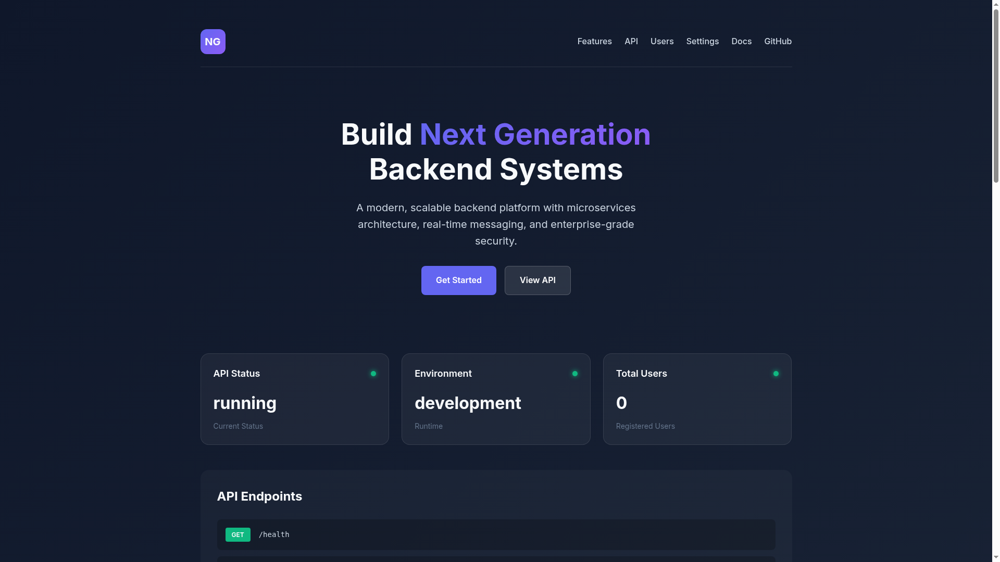
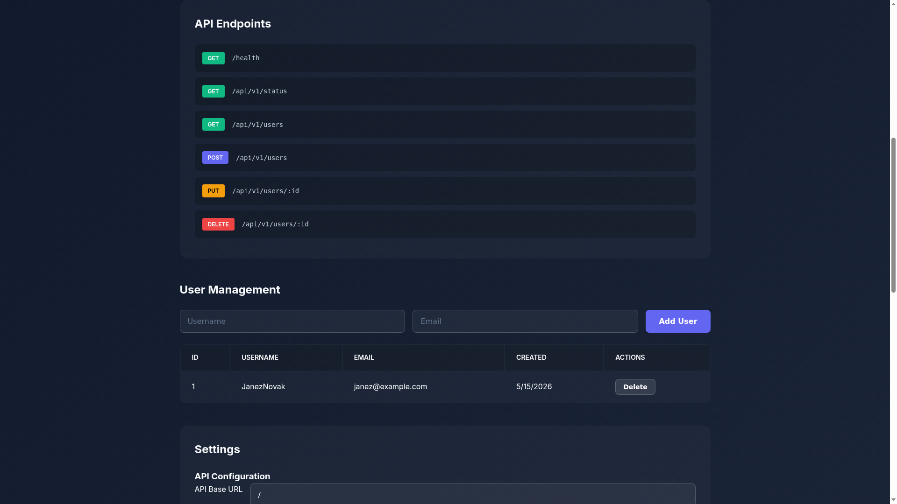
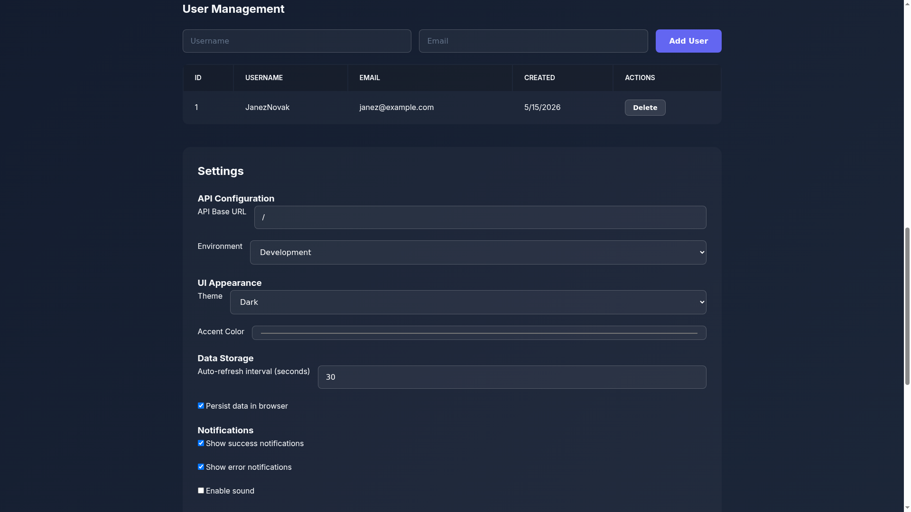

# NexGen

**Verzija:** 1.0.0
**Domena:** Zaledni sistemi
**Avtor:** MIA BUILD
**Datum:** 2024-12-24

---

## Opis

MIA BUILD project: NexGen

Ta projekt je del domene **Zaledni sistemi** (ZALEDNI_SISTEMI).

Strezniška logika in API-ji za enterprise aplikacije z visoko razpolozljivostjo.

---

## Domensko-specificne lastnosti

### Kategorije
- API razvoj (REST, GraphQL, gRPC, WebSocket)
- Vmesna programska oprema (Express, Fastify, NestJS, Koa)
- Mikrostoritve (Docker, Kubernetes, Service Mesh)
- Sporocilni sistemi (RabbitMQ, Kafka, Redis Pub/Sub)

### Kljucni koncepti
- REST API dizajn (Richardson Maturity Model Level 3)
- GraphQL sheme in resolverji
- gRPC protokolni bufferji in streaming
- Middleware verige in interceptorji
- Controller-Service-Repository vzorec
- CQRS (Command Query Responsibility Segregation)
- Event Sourcing za audit trail
- Saga vzorec za distribuirane transakcije

### Moduli
- Koncne tocke (HTTP handlers, route definitions)
- Shema validacija (Zod, Joi, class-validator)
- JWT avtentikacija in avtorizacija
- Rate limiting in throttling
- Request/Response transformacije
- Error handling middleware
- Health check endpoints
- OpenAPI/Swagger dokumentacija

### Arhitekturni vzorci za zaledne sisteme
- Hexagonal Architecture (Ports & Adapters)
- Clean Architecture
- Onion Architecture
- Vertical Slice Architecture
- Modular Monolith

### Skalabilnost
- Horizontalno skaliranje z load balancerji
- Connection pooling za baze podatkov
- Caching strategije (Redis, Memcached)
- CDN integracija za staticne vsebine
- Database sharding in replikacija

### Varnostni mehanizmi za zaledne sisteme
- OAuth 2.0 / OpenID Connect implementacija
- API key management
- CORS konfiguracija
- Helmet.js varnostne glave
- SQL injection prevencija
- XSS prevencija
- CSRF tokeni
- Rate limiting proti DDoS

---

## Skladnost

Ta projekt je skladen z naslednjimi industrijskimi in vojaskimi standardi:

| Standard | Opis | Status |
|----------|------|--------|
| DO-178C | Programska oprema za letalstvo | SKLADEN |
| IEC 61508 | Funkcionalna varnost | SKLADEN |
| ISO 26262 | Varnost avtomobilske programske opreme | SKLADEN |
| MIL-STD-882E | Vojaska varnost sistema | SKLADEN |

**Nivo varnostne integritete:** SIL-2

---

## Struktura projekta za ZALEDNI_SISTEMI

```
NexGen/
├── src/                    # Izvorna koda za Zaledni sistemi
│   ├── jedro.ts           # Jedro sistema
│   └── index.ts           # Vstopna tocka
├── testi/                  # Testi
│   └── jedro.test.ts      # Testi jedra
├── dokumentacija/          # Dokumentacija
│   ├── SPECIFIKACIJA_ZAHTEV.md
│   ├── NACRT_VERIFIKACIJE.md
│   ├── ARHITEKTURNI_OPIS.md
│   └── POLITIKA_KODIRANJA.md
├── evidence/               # Dokazila
├── konfiguracija/          # Konfiguracija
│   └── varnost.json
├── package.json
├── tsconfig.json
└── README.md
```

---

## Moduli za Zaledni sistemi

Vsi izbrani moduli

---

## Funkcije za Zaledni sistemi

Vse izbrane funkcije

---

## Namestitev

```bash
npm install
npm run typecheck
npm run build
```

---

## Varnostni koraki za ZALEDNI_SISTEMI

```bash
npm run security:scan
npm run security:sbom
npm run security:sign
```

---

## Verifikacija za Zaledni sistemi

```bash
npm run verify
```

To izvede:
1. Staticno analizo (ESLint)
2. Preverjanje tipov (TypeScript)
3. Enotne teste (Jest)
4. Preverjanje pokritosti (>= 80%)

---

## Deterministicnost

Ta projekt zagotavlja deterministicno gradnjo:

- Brez uporabe nekontroliranega casa v produkcijski logiki
- Brez nakljucnih vrednosti brez seed-a
- Brez omreznih klicev med gradnjo
- Fiksne verzije odvisnosti

---

## Licenca

MIT

---

## Kontakt

**Avtor:** MIA BUILD
**Leto:** 2024
**Domena:** Zaledni sistemi

---

## Screenshots

### 1. Home / Features (UPGRADED)

Glavna stran s status kartami, uptime, memory, requests

### 2. API Endpoints

Seznam vseh API endpointov

### 3. User Management

Uporabniška tabela z CRUD operacijami

---

## Nova Funkcionalnost (v1.1.0)

### API Endpoints
| Endpoint | Metoda | Opis |
|----------|-------|------|
| `/health` | GET | Health check |
| `/api/v1/status` | GET | API status |
| `/api/v1/info` | GET | API info |
| `/api/v1/config` | GET/PUT | Runtime konfiguracija |
| `/api/v1/metrics` | GET | Sistemski metriki |
| `/api/v1/env` | GET | Environment spremenljivke |
| `/api/v1/users` | GET/POST | Uporabniki CRUD |
| `/api/v1/users/:id` | GET/PUT/DELETE | Posamezen uporabnik |

### API Funkcionalnosti
- ✅ Rate Limiting (konfigurabilno)
- ✅ CORS konfiguracija
- ✅ JSON logging z request ID
- ✅ Runtime config preko API
- ✅ Sistemski metriki
- ✅ Input validacija
- ✅ Error handling

### UI Sekcije
- **Home** - Status kartice (API, Environment, Uptime, Memory, Requests)
- **Users** - User CRUD
- **API** - Seznam endpointov + Console
- **Config** - Runtime konfiguracija
- **Settings** - UI nastavitve
- **Metrics** - Sistemski metriki + Live console

### UI Nastavitve
- Theme (dark/light/auto)
- Accent color picker
- Auto refresh (5-300s interval)
- Notifications (success/error)
- Persist local data
